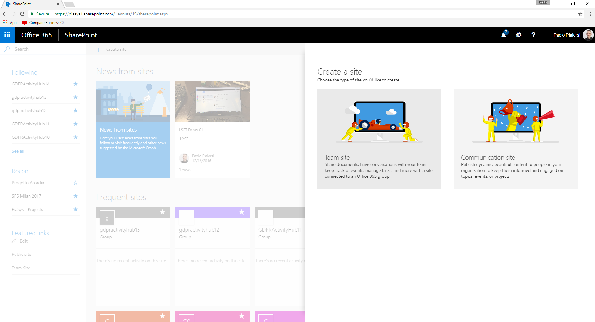
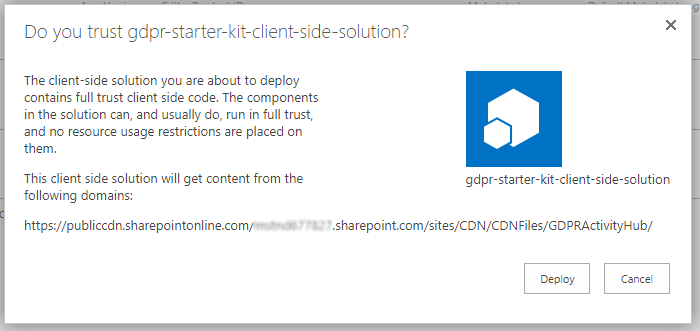
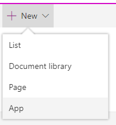
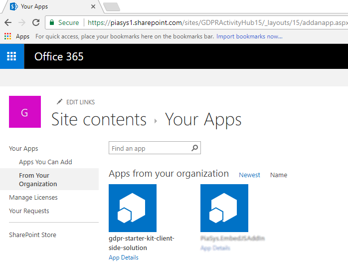
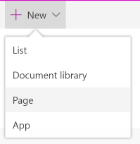
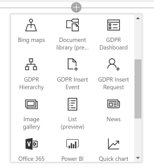
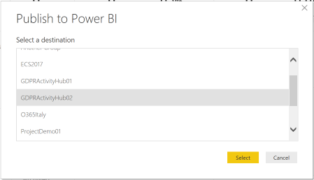

# GDPR Activity Hub - Setup Guide Using a Shared CDN
In order to setup the GDPR Activity Hub, you have to accomplish few steps. Some of these steps are automatic, some of them are manual.
Please follow carefully the following guidance in order to succeed with the project installation.

Before digging into the installation steps, you should consider the main requirements of the solution:
* You need to have a valid Microsoft Office 365 E3 subscription
* You need to have a development machine configured to create SharePoint Framework solutions (see the following steps)
* You need to install the PowerShell extensions for SharePoint Online
* You need to install the PnP PowerShell extensions

Aside from the Office 365 subscription, you will find further details about the other requirements in the following installation steps.

## Create the Modern Site
First of all, you need to create a new Microsoft Office 365 Group, which includes a modern SharePoint Online Group site (GROUP#0).
Open your preferred web browser and go to the following URL:

```PowerShell
https://<your-tenant-name>.sharepoint.com/_layouts/15/sharepoint.aspx
```

Where the placeholder <your-tenant-name> needs to be replaced with the name of your Office 365 tenant.
Click on the "+ Create Site" command button in the upper left corner of the screen, in order to create a new SharePoint Online Modern Site.



Select to create a new "Team Site" by clicking on the icon on the left side of the "Create a Site" panel.
Provide a Name and a Description for the new site and press the "Next" button.

> It is up to you to select whether the Office 365 Group will be Public or Private.

If you like to invite other people to share the site, you can select them through the "Add group members" panel that follows in the site creation flow. Once you have selected any additional members or owners, click the "Finish" button.

The Office 365 Group, together with its Modern Site, will be created in a matter of few seconds. Copy and save the URL of the just created site, because you will use it in the upcoming sections of this guide.

## Prepare the Development Environment
In order to install the GDPR Activity Hub, eventually customizing the solution and hosting it in your own hosting environment, you will need a development machine ready to build SharePoint Framework (SPFx) solutions. You can find detailed and updated instructions about how to setup up an SPFx development machine in the document ["Set up your SharePoint client-side web part development environment"](https://dev.office.com/sharepoint/docs/spfx/set-up-your-development-environment)

Now, pull the source code of the project either using [this repository](https://github.com/SharePoint/sp-dev-gdpr-activity-hub) and a GIT client, or simply download [a ZIP file](https://github.com/SharePoint/sp-dev-gdpr-activity-hub/archive/master.zip) with the source code of the solution.

If you downloaded the ZIP file, please unzip it somewhere on your local file system.

In order to execute the PowerShell scripts needed to setup the solution, you have to install a couple of PowerShell extensions, which are listed below:
* PowerShell extensions for SharePoint Online, which are included in the ["SharePoint Online Management Shell"](https://www.microsoft.com/en-us/download/details.aspx?id=35588)
* PnP PowerShell extensions, which can be installed following the [instructions provided here](https://github.com/SharePoint/PnP-PowerShell#installation).

## Provision Artifacts
Open a PowerShell console, go to the folder where you downloaded and eventually unzipped the source code of the solution, and move to the _Scripts_ sub-folder of the solution.

> Notice that you need to have an account that is Term Store Administrator in order to provision the solution, otherwise you will get an authorization exception and the setup process will fail.

Now, you can execute the following PowerShell command:

```PowerShell
.\Provision-GDPRActivityHub.ps1 -GroupSiteUrl "https://<your-tenant-name>.sharepoint.com/sites/<your-group-site-URL>" `
                                -Credentials $credentials
                                -ConfigureCDN `
                                -CDNSiteName "CDN" `
                                -CDNLibraryName "CDNFiles"
```

The PowerShell script requires some input arguments, which are:
* **GroupSiteUrl**: the URL of the Modern Site that you created before.
* **Credentials**: the credentials of a tenant administrator, which will be used to setup the solution. If you don't provide this argument, the script will prompt you for credentials during execution.
* **ConfigureCDN**: an optional switch to instruct the script to create and configure an Office 365 CDN that will host the SPFx client-side web parts.
* **CDNSiteName**: the relative URL of a SharePoint site collection that will be create to host the CDN files, if you select to create and configure the Office 365 CDN.
* **CDNLibraryName**: the name of the document library that will be created to host the CDN files.

The PowerShell script will accomplish for you the following tasks:
* Provision the Information Architecture (Taxonomy Terms, Site Columms, Content Types, Lists and Libraries) onto the target Modern Site
* Create and configure the CDN in Microsoft Office 365
* Build the SPFx solution targeting your CDN for hosting the assets
* Upload the SPFx assets to the CDN library

Once the script will be successfully executed, you will see in the console window a confirmation message like:

```PowerShell
All the automatic steps are now completed!
You can find the .SPPKG file at the following path: <your-local-path>\sharepoint\solution\gdpr-starter-kit.sppkg
```

and you will be able to take a note about the .SPPKG file path.

## Upload the SPFx package
You are now ready to upload the SPFx solution package to SharePoint Online. In order to do that, follow these steps:

* Open the _App Catalog_ site for your tenant. If you don't have one or if you don't know the URL of your _App Catalog_ site, please follow the instructions illustrated in document ["Use the App Catalog to make custom business apps available for your SharePoint Online environment"](https://support.office.com/en-us/article/Use-the-App-Catalog-to-make-custom-business-apps-available-for-your-SharePoint-Online-environment-0b6ab336-8b83-423f-a06b-bcc52861cba0?ui=en-US&rs=en-US&ad=US) to create a new _App Catalog_ site.
* Go to the "Apps for SharePoint" library of the  _App Catalog_ and upload the file named _gdpr-starter-kit.sppkg_ from the path that you saved in the previous section.
* Accept to trust and deploy the solution in your tenant by pressing the **Deploy** button in the following popup dialog.



## Add App and Create Modern Pages
Now browse to the Modern Site that you created before, Add an App by clicking the New -> App menu item highligthed in the following Figure.



In the left quick launch menu select the _From Your Organization_ menu item and select to install the app called _gdpr-starter-kit-client-side-solution_ as depicted in the following Figure.



Now go back to the home page of the site, and create four Modern Pages, by selecting the option New -> Page in the upper left menu, as like as you can see in the following Figure.



The pages to create should be:
* Insert Event/Incident: in this page you should add the client-side web part named "GDPR Insert Event". Configure the client-side web part in order to target the _Events_ list.
* Insert Request: in this page you should add the client-side web part named "GDPR Insert Request". Configure the client-side web part in order to target the _Requests_ list.
* GDPR Hierarchy: in this page you should add the client-side web part named "GDPR Hierarchy". Configure the client-side web part in order to target the _Hierarchy_ list.
* Dashboard of Tasks: in this page you should add the client-side web part named "GDPR Dashboard". Configure the client-side web part in order to target the _Tasks_ list.

In the following Figure you can see the SPFx client-side web parts defined in the GDPR Activity Hub project and available for insertion in your environment.



> Sometimes the creation of the Office 365 CDN can take a while to become ready and fully functional. In case of any failure while adding the client-side web parts to the Modern Site, please wait up to 15 minutes to allow the CDN to be ready.

Go back to the home of the site, edit the home page and remove all of the already existing client-side web parts. Add a "Power BI" client-side web part, which you will configure in the next section.

## Upload and Configuration of the Power BI dashboard
In order to install the GDPR Activity Hub dashboard based on Power BI, you need to have at least a FREE license of Power BI. Thus [download and install the Power BI desktop client](https://powerbi.microsoft.com/en-us/desktop/).

Once the Power BI Desktop client is installed, run it and open the _GDPR.pbit_ file that is located under the _Scripts_ folder of the solution that you downloaded from GitHub or from the path where you unzipped the solution.

When you open the file, it will prompt you for the URL of the GDPR Activity Hub site, as you can see in the following Figure.


Provide the URL of the Modern Site that you created and  press the _"Load"_ button. In case of need, the Power BI Desktop client will ask you for a Work and School account to use in order to access the target site. Moreover, in case the Power BI Desktop client will ask you, select the _"Organizational"_ Privacy Level.

Wait for the Power BI Desktop client to download and refresh data from your data source.

Double-check to be using the right Power BI account, in the upper right corner of the UI of Power BI Desktop, you need to target an account valid for your target tenant. If you don't have an account, you can sign-up for a new one for FREE, or you can eventually subscribe for a 60 days trial of the Power BI Pro service.

Once the refresh is completed and once you are using the right target account, click the  _"Publish"_ command in the _"Home"_ ribbon. Follow the instructions to publish the report on Power BI. In particular, select the Modern Site for the GDPR Activity Hub as the destination for your report, as you can see in the following Figure.



Once the report has been published, click on the link _"Open [name of your report] in  Power BI"_ and see your report in Power BI. Save the URL of the page, and go back to the home page of the site. 

There configure the Power BI client-side web part to target the URL of the report.

Save and Publish the new home page and you are done!

## Play with the Solution
Now you are ready to play with the solution. You can find a detailed help in the ["User Guide"](./User-Guide.md) document.
